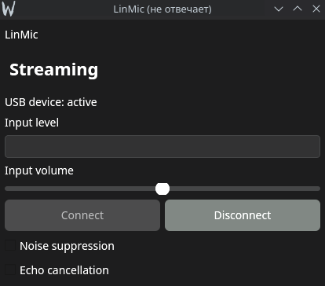
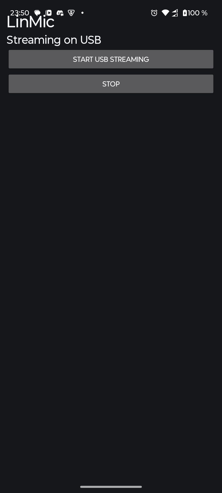
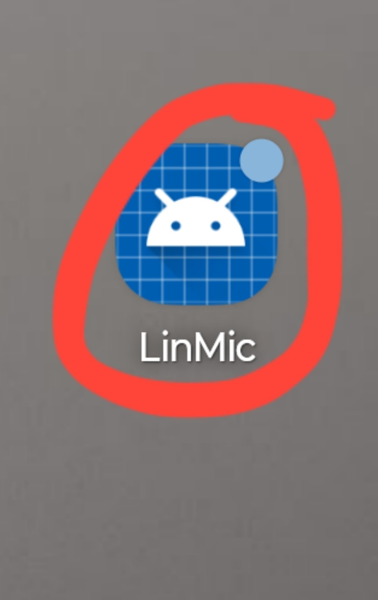

# LinMic

LinMic is a Linux-first open-source alternative to WO Mic. It turns an Android phone microphone into a Linux microphone source that apps such as Discord, OBS, browsers, and games can discover automatically through PipeWire.

## Current State

LinMic prototype is currently functional over USB using ADB forwarding and PipeWire virtual microphone integration.

Basic Android ↔ Linux audio streaming is working.

# LinMic

LinMic is an open-source Linux-first phone microphone application.

It allows you to use your Android phone as a microphone on Linux using USB and PipeWire.

## Current Features

* Android microphone streaming prototype
* PipeWire virtual microphone
* USB support via ADB
* Discord and OBS compatibility
* Linux desktop client
* Basic GUI
* Open-source

## Planned Features

* Better audio quality
* Lower latency
* Improved UI
* Auto reconnect
* Noise suppression

## Project Structure

```text id="k5g2zn"
LinMic/
├── android-app/     # Android application
├── linux-client/    # Linux desktop client
├── docs/            # Documentation
├── packaging/       # Linux packaging files
└── scripts/         # Helper scripts
```

## Tech Stack

### Linux Client

* Python
* PipeWire
* PySide6
* asyncio

### Android App

* Kotlin
* Android Studio
* AudioRecord API
* Foreground services

## Building

### Linux Client

```bash id="b7v2kn"
cd linux-client
python -m venv .venv
source .venv/bin/activate
python -m pip install .
python -m linmic
```

### Android App

Open the `android-app` folder in Android Studio and run the project on your Android device.

USB debugging must be enabled on the phone.

## Status

Early development / alpha

## License

MIT License

## Screenshots

### Linux Client



### Android App



